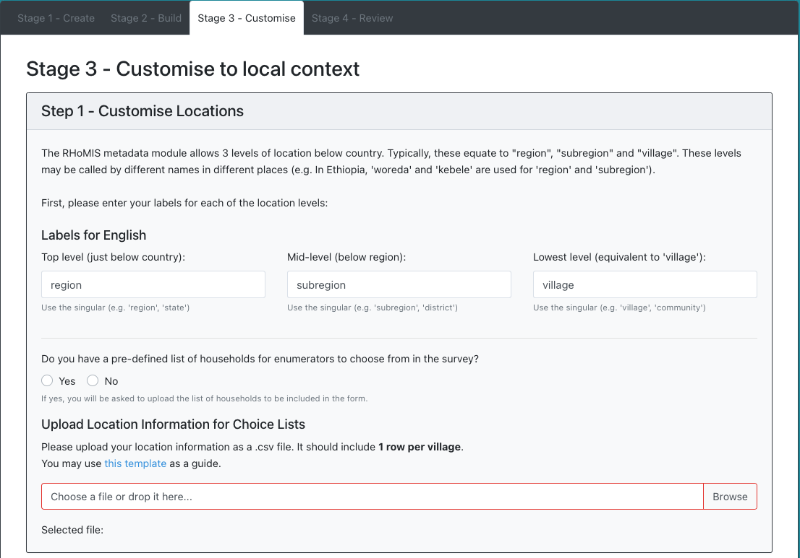

.. _survey builder:

Building a Survey
===========================

The design of a survey takes place in 4 main stages:

1. **Initialisation**: Name your project/questionnaire
2. **Build**: Build a survey by selecting predefined modules
3. **Localisation**: Select choices which are appropriate for the location where you will conduct your survey
4. **Review**: See an overview of your survey, with options to test in ODK or download in Excel.

1. Initialising your Project
#######################################

When you visit the survey builder, you will see a form
which looks like the one below. Here you will enter
information on the questionnaire you are building. You
will first need to select a project name, a form name,
and enter some metadata about how you intend to use
the survey. Once you have finished entering the metadata,
press "Save and Continue".

.. admonition:: Projects and Forms

    Projects and forms are a useful way to
    organise your questionnaires.

    - **Projects** can contain many forms. It can be helpful to store related forms within a project.
    - **Forms** are the questionnaires themselves.

2. Designing Your Questionnaire
#######################################

.. sidebar:: Modules

    Core modules are used in most RHoMIS surveys. they are essential
    for calculating key indicators such as household size, income,
    food security, and dietary diversity. At present, all forms
    must include the core modules. For shorter surveys, a 'reduced core'
    is available, which retains most of the key indicators while reducing
    the length of the survey significantly.

    Additional modules are available to add to the questionnaire. They
    include more specific questions on specialist topics. See the
    :download:`RHoMIS Module Booklet <../files/rhomis_modules_booklet.pdf>`
    for more information

During the questionnaire design, you can select from a
set of premade modules. Core modules are preselected for
you. Available modules can be added by dragging from
"available modules" (on the left), into "selected modules"
on the right.

A few things to keep in mind when building a survey:

- Try to keep the survey short, this will be less troublesome for the respondent and increase the likelihood of reliable answers.
- Every form must start and end with the Metadata modules. The Demographics module is also fixed to the start of the survey.
- You can reorder the selected modules by dragging them. This will change the order they appear in the form.

  - Some modules have specific rules about where they must go in relation to other modules. The builder will notify you if there are issues when reordering modules.
- You can view information on the modules by clicking on them.

When you save your form, the XLSForm file will be compiled and deployed to ODK. Once complete, you will be able to:

- Try out the form in ODK Collect
- Download the form in XLS format to review offline

.. note::
    It can take a while for the survey to build and save!

|

.. youtube:: QjtBvouL128
    :width: 100%

|

3. Localising Your Questionnaire
#######################################

Once you have built your main survey, you can begin to localise your
questionnaire. This is done in 2 steps.

Step 1: Customise Locations
**************************************

In each RHoMIS survey there is a metadata module. This collects
information on the time and location of the interview. Enumerators
need a list of locations to choose from to ensure data quality.

During stage 1 of the customisation you can enter which locations
the survey will be conducted. This can be changed at a later date.
We offer the ability to include 3 levels of region.

1. Top level: The administrative level just below country. Here we could select region, state, or county.
2. Mid level: The administrative level just below the top level. Here we could select subregion or district.
3. Lowest level: The smallest adminstrative unit in the sample (usually "village").

There is also the option to add a pre-defined list of households. For example,
you may have pre-made household IDs that you want enumerators to select from
during the survey. By default, this is turned off, but if you turn it on

Download the location template and begin filling in. the table should
look something like this:

.. list-table::
   :widths: 25 25 25 25 25 25 25 25 25 25 25 25
   :header-rows: 1

   * - country_id
     - country_label_en
     - country_label_lang2
     - region_id
     - region_label_en
     - region_label_lang2
     - subregion_id
     - subregion_label_en
     - subregion_label_lang2
     - village_id
     - village_label_en
     - village_label_lang2

   * - ke
     - Kenya
     - Kenya
     - region_1
     - Region 1
     - Region 1
     - subregion_1
     - Subregion 1
     - Subregion 1
     - village_1
     - Village 1
     - Village 1

   * - ke
     - Kenya
     - Kenya
     - region_1
     - Region 1
     - Region 1
     - subregion_1
     - Subregion 1
     - Subregion 1
     - village_2
     - Village 2
     - Village 2

   * - ke
     - Kenya
     - Kenya
     - region_1
     - Region 1
     - Region 1
     - subregion_2
     - Subregion 2
     - Subregion 2
     - village_3
     - Village 3
     - Village 3

This file should have 1 row per village, or 1 row per household if you have
chosen to include a pre-defined list of households for your enumerators.

Once you have filled it in, you should upload it. The data will be taken and
included as choice lists into the survey.

.. sidebar:: Localising Choices

    Localisation means making your survey
    relevant for the location you intend to
    conduct the survey.

    For example, with the question "What area of land is
    cultivated by your household?". It is useful to
    think of which options which will be most
    meaningful for the respondents and the enumerators.
    Will "hectares" be meaningful for respondents
    in your location, or acres?

Step 2 - Customise Response Option Lists
****************************************

You will need to verify several multiple
choice option lists. For each list, there are
predefined options which have occured frequently
in RHoMIS surveys. For example, with "crop_sale_price_quantityunits",
common options include "total_income_per_year", "price_per_kg", "price_ber_bag_50kg",
and "price_per_tonne".

For each list, please review the set of available options, and drag
the items you want to include into the "selected options" list on the right.
You can also add custom items to any list. For custom items, you will need to enter:

- **the name** - this is the 'value' of the choice that will appear in the raw data.
- **the label** - for each langauge of the form, you should enter the label that will appear to enumerators.

**Unit Lists**

First, there is a set of unit lists to confirm. For these,
we recommend you pick any of the common options that are relevant
to your context, then add any local units that you need.

.. note::
    When processing the data, you will be asked for conversion factors
    for any custom units you add. This will allow the automatic processing
    of the values and calculation of the indicators for each module.

**Other Lists**

The other lists are all choice lists that vary from country to country, for example "crops" and "livestock".
Each list has a set of available options, and shows the questions from the survey that use the list.

.. warning::
    Please review the list of available options before adding custom versions. This will make it easier to combine your survey data with the full RHoMIS dataset.

|

.. youtube:: W8as6TAd-WE
    :width: 100%

|

4. Reviewing Your Questionnaire
#######################################

The last stage in the survey builder is a review page. This
provides a summary of your form, and highlights any customisations
that have not yet been completed.

At this stage, we suggest
:ref:`collecting some draft data <collect_draft_data>`.
By collecting draft data, you will be able to see how the
survey flows and what the results will look like.

Once you are happy with your form, you can finalise and begin
collecting "real" data.

.. warning::
    Once your form it is built it will be saved as a draft.
    This allows you to collect test data to trial the form.

    Once you are happy with your form you can finalise it.
    Finalising a form locks it in place, but will also delete
    draft entries.

Revising Your Questionnaire
#######################################

At any point, modify your form by returning to the home page.
Select "Manage Existing Projects", then select your project. In the table of forms,
click "Options", then click "Edit draft". If the form is already
finalised, you will see the option to "Create New Draft", which will
allow you to edit a new version of the form without changing the
live version.

Updating a Live Questionnaire
#######################################

Often, you will want to make changes to a form after
you have started live collection, for example to:

- Add new enumerators or locations to the survey choice lists;
- Fix issues arising after a pilot test or during fieldwork.

You can do this by creating a new 'draft' version of any form. Any updates
you make to the draft version will *not* affect the 'live' version of a form.
This allows you to test changes without affecting any active fieldwork. Once
you are happy with the new 'draft' version, you can finalise it and update the
'live' version.

Once the live version is updated, all enumerators will automatically
receive the new version as soon as their device gets a network connection. No
action is necessary by the enumerators to download new form updates.

.. warning::
    Please be careful when updating a form mid-survey. We suggest only making necessary changes, and not making large changes to the survey structure, like adding or removing modules, unless absolutely necessary.

