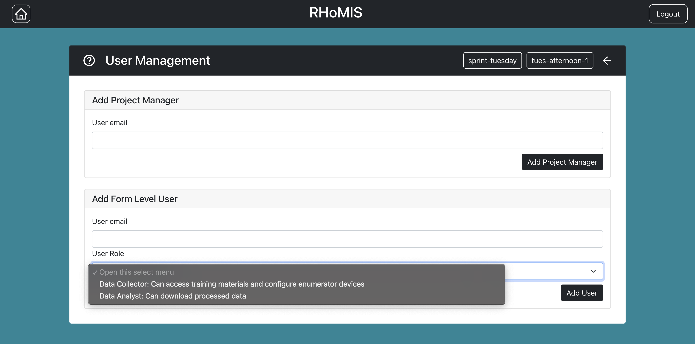

.. _navigation:

Navigating the App
================================

.. _survey building:

Survey Construction and Modification
#######################################

For more information on building and
editing surveys, please see :ref:`here <survey builder>` 

.. _project management:

Project Management
#######################################

The project management page allows you to view
your existing projects. You can select a project,
or you can create a new project (selecting this
will take you to the survey builder)

.. _form overview:

Form Management
#######################################

You will notice in the form overview that there 
are a few options. For "draft surveys", you can
test and edit surveys

For "live surveys" you can collect data,
access/process your data.

For both draft and lives surveys you 
can control access. See more on
user management :ref:`below <user management>` 

.. _data collection:

Data Collection
#######################################

For more information on data collection, please see
:ref:`here <collect_data>`

.. _data access:

Data Access
#######################################

For more information on data collection, please see
:ref:`here <processing_data>`

.. _user management:

User Management
#######################################

To control who has access click the 
"user management" option, shown in 
the 
:ref:`form management <form overview>`
section. 

This will take you to the following page:

You will only be able to control user priveleges
if you are a "project manager". A user is automatically
given "project manager" priveleges when the create 
a form/project. A project manager can add other 
project managers. A data collector can only collect data.
A data analyst can only access data.

